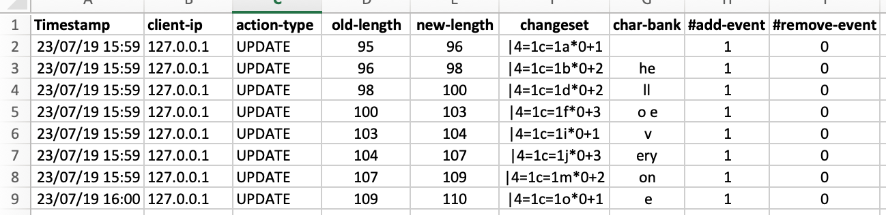

ep_update_trackv2
=======

An etherpad-lite plugin to track updates in pads and store them in CSV format for further processing. This plugin utilizes [server hooks](https://github.com/ether/etherpad-lite/wiki/Plugin-API-Hooks) (handleMessage) and record whenever a update event is detected.

This is version of ep_update_track with additional functionalities e.g., capturing chat events, automatic mapping of users, tracking of client id with IP address.
# Installing
    npm install PATH/TO/THIS/FOLDER (from your etherpad-lite folder)

# Files
This new version creates four files- group_membership.csv, user_mapping.csv, log_data.csv, and chat_msg_all.csv.

 1. group_membership.csv file stores information regarding which user belongs to which pad id . the record format is as following
    <pad-id, client-id, token>
    pad-id: this is the id of pad.
    client-id: this is id of client socket.
    token: this can be used to fetch author information.
 2. user_mapping.csv file stores mapping between user name and client-id.
    <client-id, author-id,author-name>
    client-id: this is id of client socket.
    author-id: Etherpad generated id for the participant.
    author-name: Author name.
 3. chat_msg_all.csv file store all chat messages in <timestamp, client-id, chat-msg> format.
 4. log_data.csv file store participant's editing activities. Similar to what previous version was recording (as shown in below image), the new version also records client-id with each record.

  

The order of attributes are timestamp,client-ip,action-type,old-lenght,new-length, changeset,character-bank,no-of-add-event,no-of-remove-event.
  * **Timestamp:** Timestamp of update event
  * **client-ip:** IP address of the client who is updating the pad
  * **action-type:** Currently, it only stores UPDATE event.
  * **old-lenght:** This is the length of text in the pad before the update event.
  * **new-length:** This is the length of text after updating it. For instance, if a user updated the pad and remove 2 characters then new lenght will be old-length - 2.
  * **changeset:** It is the way in which Etherpad keeps the track of updates. It contains information regarding what operation has been performed and where in the text. For more information, please visit this [link](https://github.com/ether/etherpad-lite/wiki/Changeset-Library).
  * **character-bank:** In case of add event (when client write some thing), it contains the new characters addedd to the text. In the case of remove event (when client delete something), it contains empty string.
  * **no-of-add-event:** It represents the number of add event ("+") found in the changeset.
  * **no-of-remove-event:** It represent the number of remover event ("-") found in the changeset.

# File location
The csv file gets stored in the etherpad root directory. Currently, this is for testing purpose.
